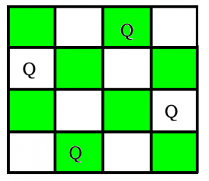

# N-Queen problem using Genetic Algorithm

Solving N-Queen problem using Genetic Algorithm.

## N-Queen Genetic

> The aim of N-Queens Problem is to place N queens on an N x N chessboard, in a way so that no queen is in conflict with the others.



The N Queen is the problem of placing N chess queens on an N×N chessboard so that no two queens attack each other. For example, following is a solution for 4 Queen problem.


You can read an article for N-Queen at [here](article.pdf).

I developed this program in **1 years ago**.

### Using

```
git clone https://github.com/BaseMax/N-QueenGenetic
cd N-QueenGenetic
g++ N-QueenGenetic.cpp -o nqueen
Edit QueenGenetic.cpp file and put your board size and number, then;
./nqueen
```

### Read more

**Recommended:** Please try your approach on {IDE} first, before moving on to the solution.

- https://www.geeksforgeeks.org/n-queen-problem-backtracking-3/
- https://www.geeksforgeeks.org/printing-solutions-n-queen-problem/

### Output

```
[max@base N-QueenGenetic]$ ./nqueen 
Possible Solution #1:	61528374
Possible Solution #2:	63185247
Possible Solution #3:	75316824
Possible Solution #4:	17468253
Possible Solution #5:	51863724
Possible Solution #6:	53847162
Possible Solution #7:	27581463
Possible Solution #8:	63741825
Possible Solution #9:	82417536
Possible Solution #10:	47526138
Possible Solution #11:	63175824
Possible Solution #12:	42751863
Possible Solution #13:	48531726
Possible Solution #14:	62714853
Possible Solution #15:	53168247
Possible Solution #16:	46827135
Possible Solution #17:	71386425
Possible Solution #18:	41586372
Possible Solution #19:	16837425
Possible Solution #20:	64158273
Possible Solution #21:	52814736
Possible Solution #22:	47531682
Possible Solution #23:	36418572
Possible Solution #24:	64285713
Possible Solution #25:	35841726
Possible Solution #26:	58413627
Possible Solution #27:	26174835
Possible Solution #28:	52617483
Possible Solution #29:	41582736
Possible Solution #30:	47185263
Possible Solution #31:	35286471
Possible Solution #32:	52473861
Possible Solution #33:	36824175
Possible Solution #34:	58417263
Possible Solution #35:	63184275
Possible Solution #36:	48136275
Possible Solution #37:	57248136
Possible Solution #38:	36428571
Possible Solution #39:	51842736
Possible Solution #40:	42857136
Possible Solution #41:	74258136
Possible Solution #42:	63581427
Possible Solution #43:	37286415
Possible Solution #44:	25713864
Possible Solution #45:	48157263
Possible Solution #46:	72418536
Possible Solution #47:	51468273
Possible Solution #48:	36258174
Possible Solution #49:	57263148
Possible Solution #50:	36271485
Possible Solution #51:	31758246
Possible Solution #52:	53172864
Possible Solution #53:	15863724
Possible Solution #54:	42736815
Possible Solution #55:	42736851
Possible Solution #56:	83162574
Possible Solution #57:	63724815
Possible Solution #58:	24683175
Possible Solution #59:	62713584
Possible Solution #60:	82531746
Possible Solution #61:	36814752
Possible Solution #62:	84136275
Possible Solution #63:	63728514
Possible Solution #64:	42861357
Possible Solution #65:	57138642
Possible Solution #66:	17582463
Possible Solution #67:	74286135
Possible Solution #68:	57142863
Possible Solution #69:	42586137
Possible Solution #70:	27368514
Possible Solution #71:	46831752
Possible Solution #72:	72631485
Possible Solution #73:	35714286
Possible Solution #74:	36275184
Possible Solution #75:	46152837
Possible Solution #76:	47382516
Possible Solution #77:	64713528
Possible Solution #78:	63571428
Possible Solution #79:	26831475
Possible Solution #80:	73825164
Possible Solution #81:	68241753
Possible Solution #82:	28613574
Possible Solution #83:	73168524
Possible Solution #84:	57263184
Possible Solution #85:	38471625
Possible Solution #86:	37285146
Possible Solution #87:	64718253
Possible Solution #88:	35281746
Possible Solution #89:	57413862
Possible Solution #90:	52468317
Possible Solution #91:	36815724
Possible Solution #92:	25741863
```
----

# Max Base

My nickname is Max, Programming language developer, Full-stack programmer. I love computer scientists, researchers, and compilers. ([Max Base](https://maxbase.org/))

## Asrez Team

A team includes some programmer, developer, designer, researcher(s) especially Max Base.

[Asrez Team](https://www.asrez.com/)

